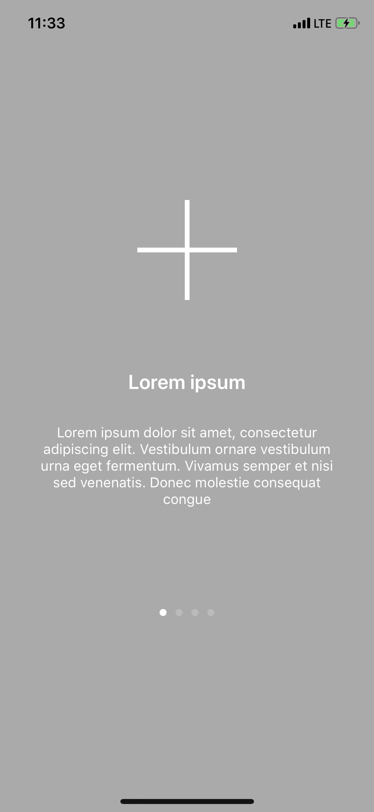
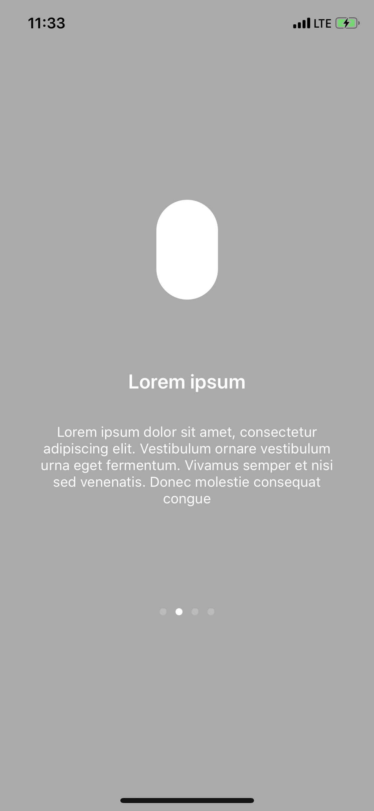
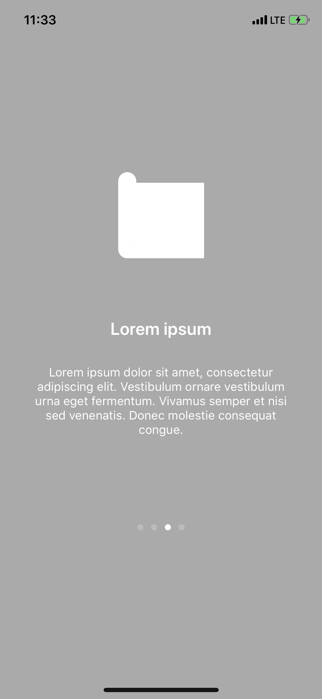
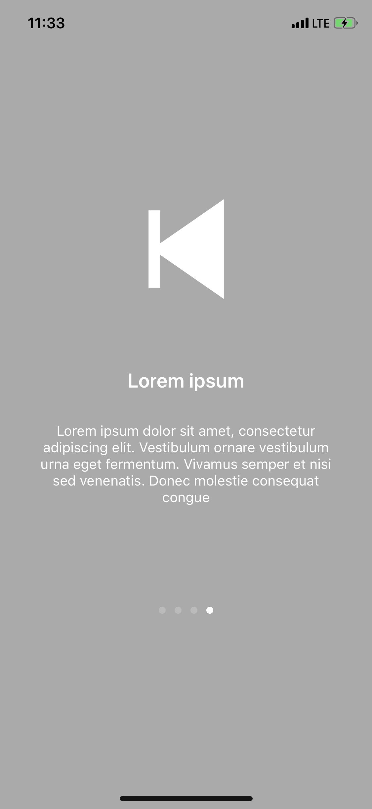

# OnBoardingScreen
> This is an easy and Elegant onBoarding screen which you can easily implemet in your application.

[![Build Status][travis-image]][travis-url]

OnBoardingScreen gives you a smooth and easy experience when implemeting in your app. It is easy to customize and modify.

<div float="left">
  
  
   
  
</div>

## Installation

Cocoapods:

```
Coming Soon
```

Cartage:

```
Coming Soon
```

Manually:

```
Clone the project and drag the entire Onboarding folder to your app
```

## Usage example

A few motivating and useful examples of how your product can be used. Spice this up with code blocks and potentially more screenshots.

_For more examples and usage, please refer to the [Wiki][wiki]._

## Development setup

### Initiate OnBoardingManager in your UIViewController like this

    let onBordingViews = [
        OnBoardingManager(title: "Lorem ipsum", subtitle: "Lorem ipsum dolor sit amet, consectetur adipiscing elit. Vestibulum ornare vestibulum urna eget fermentum. Vivamus semper et nisi sed venenatis. Donec molestie consequat congue", icon: "add"),
        OnBoardingManager(title: "Lorem ipsum", subtitle: "Lorem ipsum dolor sit amet, consectetur adipiscing elit. Vestibulum ornare vestibulum urna eget fermentum. Vivamus semper et nisi sed venenatis. Donec molestie consequat congue", icon: "bluetooth"),
        OnBoardingManager(title: "Lorem ipsum", subtitle: "Lorem ipsum dolor sit amet, consectetur adipiscing elit. Vestibulum ornare vestibulum urna eget fermentum. Vivamus semper et nisi sed venenatis. Donec molestie consequat congue.", icon: "blueprint"),
        OnBoardingManager(title: "Lorem ipsum", subtitle: "Lorem ipsum dolor sit amet, consectetur adipiscing elit. Vestibulum ornare vestibulum urna eget fermentum. Vivamus semper et nisi sed venenatis. Donec molestie consequat congue", icon: "back"),
    ]
    
### call the onBoardingViews in your viewDidLoad and access other properties
    override func viewDidLoad() {
        super.viewDidLoad()
        onBordingViews.forEach { (manager) in
            // Changing the background
            manager.subtitleLabelTextColor = UIColor.green
            onBoardingFunc()
        }
    }

    fileprivate func onBoardingFunc() {
        let onBoardingPC = self.onBoardingPC()
        onBoardingPC.delegate = self
        self.addChildViewControllerWithView(onBoardingPC)
    }
    

### Delegate method on what to do on completion

extension ViewController: OnboardingVCDelegate {
    func onBoardingDidStartFlow(_vc: OnboardingPC) {
        //
    }
    
    func onBoardingDidFinishFlow(_ vc: OnboardingPC) {
        UIView.transition(with: self.view, duration: 1, options: .transitionFlipFromLeft, animations: {
            vc.view.removeFromSuperview()
            let viewControllerToBePresented = LandingVC(nibName: "", bundle: nil)
            //                UIViewController()
            let navController = UINavigationController(rootViewController:viewControllerToBePresented)
            self.addChild(navController)
            navController.view.frame = self.view.bounds
            self.view.addSubview(navController.view)
        }, completion: nil)
    }
    
    fileprivate func onBoardingPC() -> OnboardingPC {
        let viewControllers = onBordingViews.map { OnboardingContainerVC(manager: $0, nibName: "", bundle: nil) }
        return OnboardingPC(nibName: "",
                            bundle: nil,
                            viewControllers: viewControllers)
    }
}
### Other accessible variables

    onBoardingViewBackgroundColor: UIColor = .lightGray
    
    subtitleFontSize: CGFloat = 14.0
    
    titleFontSize: CGFloat = 20.0
    
    imageViewcontentMode: UIImageView.ContentMode = .scaleAspectFill
    
    imageViewclipsToBounds: Bool = true
    
    imageViewtintColor: UIColor = .white
    
    imageContainerViewBackgroundColor: UIColor = .clear
    
    titleLabelTextColor: UIColor = .white
    
    subtitleLabelTextColor: UIColor = .white

## Release History

* 0.0.1
    * CHANGE: Update docs (module code remains unchanged)


## Meta

Adie Olalekan – [@AdieOlami](https://twitter.com/AdieOlami) – ugbeadie@gmail.com

Distributed under the MIT license. See ``LICENSE`` for more information.

[https://github.com/AdieOlami/OnBoardingScreen.git](https://github.com/AdieOlami/)

## Contributing

1. Fork it (<https://github.com/AdieOlami/OnBoardingScreen/fork>)
2. Create your feature branch (`git checkout -b feature/fooBar`)
3. Commit your changes (`git commit -am 'Add some fooBar'`)
4. Push to the branch (`git push origin feature/fooBar`)
5. Create a new Pull Request

<!-- Markdown link & img dfn's -->
[travis-image]: https://img.shields.io/travis/dbader/node-datadog-metrics/master.svg?style=flat-square
[travis-url]: https://travis-ci.org/dbader/node-datadog-metrics
[wiki]: https://github.com/AdieOlami/OnBoardingScreen/wiki
